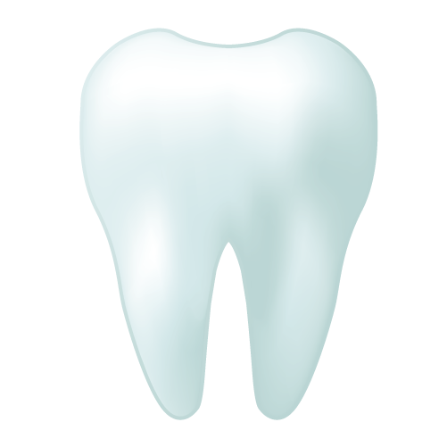

Proposal for new emoji: **Body Parts**
==================================

- **Author:** Christoph Päper
- **Mail:** christoph.paeper@crissov.de
- **Submitted:** 2017-06-30
- **Latest version:** https://crissov.github.io/unicode-proposals/body-parts

Introduction
------------

I hereby request the addition of eight external body part emojis to the Unicode Standard in order to complete the existing set of extremities. 
These are a **foot**, a **leg**, a **buttocks**, a generic **genital area**, a **belly**, a **breast**, a **tooth** and a **bone**. 

Rationals, glyph examples, character properties as well as discussion of inclusion and exclusion factors are included on the following pages. As per [emoji submission guidelines](http://www.unicode.org/emoji/selection.html\#submission) this document does not include the character proposal form.

Since breasts and genitals differ significantly between male and female human bodies, but their depiction is also tabooesque in many contemporary cultures, I am also proposing to document ZWJ sequences using the Female Sign ♀ U+2640 and the Male Sign ♂ U+2642 as determiners (i.e. second part), which has many precedents for fuller-body emojis (e.g. professions) from Unicode Emoji 4.0 onwards.

The Unicode Standard already includes several body parts: 

Names
--------------------

The preferred [English CLDR data](http://www.unicode.org/cldr/charts/latest/annotations/germanic.html) of the proposed characters are as follows; existing body parts shown for comparison, additions emphasized by boldface:

| Short name       | Keywords                                 |
| ---------------- | ---------------------------------------- |
| **foot**         | **body, walk**                           |
| 👣 footprints    | clothing, footprint, print, **walk**     |
| **leg**          | **body, thighs, calves**                 |
| **buttocks**     | **body, behind, arse**                   |
| **genital area** | **body, pubes, crotch, groin, loins, pelvis** |
| **vulva**        | **body, genital, vagina, clitoris, female, woman** |
| **penis**        | **body, genital, testicles, male, man**  |
| **belly**        | **body, bellybutton, navel, tummy**      |
| **breast**       | **body, bust, nipples**                  |
| **boobs**        | **body, breast, mammaries, bosom, female, woman** |
| **chest**        | **body, breast, male, man**              |
| 💪 flexed biceps | biceps, comic, flex, muscle, **arm, body** |
| ✋ raised hand    | hand, **touch**                          |
| 👅 tongue        | body, **lick, taste**                    |
| 👄 mouth         | lips, **teeth, eat, speak, talk, body, face** |
| **tooth**        | **teeth, dental**                        |
| 💋 kiss mark     | kiss, lips, **sex**                      |
| 👃 nose          | body, **smell, face**                    |
| 👂 ear           | body, **listen, hear, face**             |
| 👁 eye           | body, **see, watch, look, face**         |
| 👀 eyes          | eye, face                                |
| 🧠 brain         | intelligent, **think, organ**            |
| **bone**         | **skeleton, femur**                      |

<!-- Guts, Heart Organ, Lungs, Liver, Stomach, Colons -->

Emoji ZWJ sequences
-------------------

### Genitalia

♀ ZWJ sequence (U+2640): Vulva, Vagina, Labia, Clitoris; Ovaries, Uterus
♂ ZWJ sequence (U+2642): Hanging Penis and Testicles; Erect Penis

### Chest

♀ ZWJ sequence (U+2640): Breasts, Bosom
♂ ZWJ sequence (U+2642): Hairy Chest

Images
---

.png).png).png).png).png)

.png).png).png).png).png)

.png).png).png).png).png)

.png).png).png).png).png)

.png).png).png).png).png)

.png).png).png).png).png)

.png).png).png).png).png)

.png).png).png).png).png)

Factors for Inclusion
---------------------

### A. Compatibility:

There are no known legacy character sets containing any of the body parts proposed.

There are some emoji-like image sets, including stickers in messaging apps, that
include graphics for body parts, which may either be explicit or implicit metaphors, e.g. a strawberry cut in half vertically to symbolize a vagina.

### B. Expected Usage Level:

Most existing body part emojis &ndash; except for hands &ndash; are not among the frequently used ones. Even the food emojis used metaphorically are not used much, at least not in the public metrics available.

| Emoji             | [Emojistats][] daily    | Base          |
| ----------------- | ----------------------- | ------------- |
| 💋 kiss mark      | 12k+2.9k+2.2k+1.4k+1.0k |               |
| 💪 flexed biceps  | 2.3k                    |               |
| 👀 eyes           | 2.0k                    |               |
| 👅 tongue         | 1.6k                    |               |
| ✋ raised hand     | 0.52k                   |               |
| pear butt         | 0.52k                   | <0.1k         |
| lemon boobs       | 0.51k                   | <0.1k         |
| strawberry vagina | 0.47k                   | 0.17k + 0.14k |
| eggplant          | 0.47k                   |               |
| peach             | 0.40k                   |               |
| 👄 mouth          | 0.33k                   |               |
| 👁 eye            | 0.32k                   |               |
| melon boobs       | 0.32k                   | 0.16k         |
| 👣 footprints     | 0.18k                   |               |
| 👃 nose           | 0.10k                   |               |
| 👂 ear            | <0.1k                   |               |
| 🧠 brain          | ?                       |               |

I have included several charts supplied by Google Trends showing the frequency
of searches for “[______]” in comparison to other emoji.

Google search for the term “[______]” returns [______] results,
which is more than for [______].

### C. Image distinctiveness:

...

### D. Completeness:

The major goal of this proposal is to complete the set of external human body parts.

### E. Frequently Requested:

<!--
ASCII emoticons

        ..,          ,,,
       q(ö)p        d(W)b
      __/^__      __/V__
     //(.Y.)\\    //(`:´)\\
    ||  )*(  ||  || ) : ( ||
    nm ( Y ) mn  nm (_!_) mn
       | | |        |_|_|
       |^|^|        | | |
      o__|__o      .__|__.

Phallic symbols Flirtmoji, stickers
-->

Factors for Exclusion
---------------------

### F. Overly Specific:

People rely on visual or linguistic emoji metaphors for the most wanted body parts. This is not an indication that the parts proposed herein would be overly specific, but some may be felt as overly *explicit*.

### G. Open-ended:

While there are several internal organs with iconic shapes and several other named external parts of the human body, the present list aims to be exhaustive.

### H. Already Representable:

People currently are using a variety of metaphors especially for genitalia.

The meat-on-bone and the skull-with-crossbones emojis already include **bones**.

### I. Logos, Brands etc.

No.

### J. Transient:

No. The human body and its parts have been pictured and spoken about ever since humankind became able to do it, and always will. 

Character Properties
---

They should be added to the [______] block near other [______] emoji.
In collation order they should be sorted near other body part emojis. 
They should definitely be part of the [______] category.

Most of the proposed body part emojis do make use of emoji modifiers! 
They all have emoji presentation by default. 

References
----------

[1] ______: ______ (______)

License
-------

The sample images and the sample font included in this proposal were created by
me and me alone. I hereby declare that the Unicode Consortium and its members
are granted the right to use, edit and redistribute these contents in any way
they want without restriction. Copies of the sample images and font are
available at the following address:

Screenshots were taken from Google Trends (https://www.google.com/trends/) and
Twitter (https://twitter.com).
