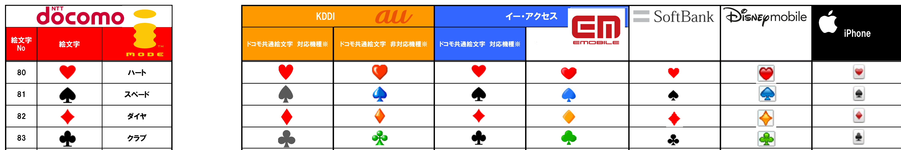

Re *Emoji and Vendors*
===

Mark Davis, presumably on behalf of the Emoji Subcommittee, submitted a whitepaper on 28 June 2017 to clarify the influence of major vendors (Apple, Facebook, Google, Microsoft, Twitter, maybe also non-member Samsung), entitled _Emoji and Vendors: for consideration by the UTC_. It was on the [agenda of UTC#152], but I cannot find any mention of it in the [minutes of UTC#152].

I have no doubt that the text accurately describes how the process of encoding new emoji characters currently works. As already documented in [L2/147], which is backed by [L2/329], I strongly believe this process needs refinements.

Below, I will only quote from _section 2_ of the document [L2/206], because _section 1_ just describes uncontroversial common knowledge about the encoding process for *usual* characters. It expressively assumes that emojis are unusual, a notion I will contest.

  [agenda of UTC#152]: 
  [minutes of UTC#152]: 
[L2/147]: http://www.unicode.org/L2/L2017/17147-emoji-subcommittee.pdf "Request for greater transparency in the Emoji Subcommittee by Andrew West, Charlotte Buff and Christoph Päper"
[L2/206]: http://www.unicode.org/L2/L2017/17206-emoji-and-vendors.pdf "Emoji and Vendors: for consideration by the UTC by Mark Davis"
[L2/329]: http://www.unicode.org/L2/L2017/17329-n4888-future-add-nsai.pdf "Future Additions to ISO/IEC 10646 (WG2 N4888)"

> Emoji characters are quite different.

Pictographs
---

> There is an unlimited number of possible images of things, and there is no goal to encode them all, or even any large number of them.

My first issue is with terminology. We must not think of emojis as images!

An _image_ depicts some graphic original and in the case of a _picture_ it is the original itself.

icon, 

pictograph

Popularity
---

> the goal is to progressively add sets of emoji that will be popular

There are different types and measures of popularity.

* _Local and global popularity_: geographically, 
* _Recurring and fading popularity_: 
* _Relative and absolute popularity_: 
* _Perceived and actual popularity_: 
* _Local popularity_: 
* _Local popularity_: 
* ​

Vendors
---

> It would be pointless &hellip; to include an emoji that did not end up being supported by major vendors. 

Gatekeeper

Sets
---

Synthesis
---

combining emoticons

Conclusion
---

Annex: Sets
---

### Astrological metaphors

https://github.com/Crissov/unicode-proposals/issues/388

#### Celtic zodiac signs

The Celtic zodiac is based on a lunar cycle and thus includes 13 signs.

I have not yet determined whether there ever was a canonical set of zodiac signs and how much is specified by recent neo-pagan culture.

#### Amerindian spirit or totem animals

I do not know whether pre-columbian Amerindian peoples identified the same constellations as did the Europeans, but there seems to be an established folk tradition now to correlate the 12 old-world zodiac signs with new-world totems or spirit animals. There is some variation among sources as to which animals are used, but it is always only animals.

| Sign                                     | Start date   | Equivalent                   |
| ---------------------------------------- | ------------ | ---------------------------- |
| **Goose**, ![:bear:] Bear                | December 22  | ![:capricorn:] Capricorn     |
| **Otter**, **Magpie**                    | January 20   | ![:aquarius:] Aquarius       |
| ![:wolf:] Wolf, (![:leopard:] Cougar, ![:whale:] ![:whale2:] Whale | February 20  | ![:pisces:] Pisces           |
| **Falcon**, **Hawk**, ![:wolf:] Wolf     | March 20     | ![:aries:] Aries             |
| **Beaver**, **Elk/Moose**                | April 20     | ![:taurus:] Taurus           |
| ![:deer:]Deer, ![:eagle:] Eagle          | May 21       | ![:gemini:] Gemini           |
| (![:bird:] **Woodpecker / Flicker**, (![:fish:] **Salmon** | June 21      | ![:cancer:] Cancer           |
| (![:fish:] **Salmon / Sturgeon**, (![:leopard:] **Cougar** | July 22      | ![:leo:] Leo                 |
| ![:bear:]Bear, ![:owl:] Owl              | August 22    | ![:virgo:] Virgo             |
| Raven / Crow, ![:dove:] Dove             | September 22 | ![:libra:] Libra             |
| ![:snake:] Snake, **Eel**                | October 23   | ![:scorpius:] Scorpius       |
| ![:owl:]Owl, ![:horse:] ![:racehorse:]  Horse, **Elk/Moose** | November 23  | ![:sagittarius:] Sagittarius |

[:bear:]: https://rawgit.com/emojitwo/emojitwo/master/png/48/1f43b.png "Bear"
[:deer:]: https://rawgit.com/emojitwo/emojitwo/master/png/48/1f98c.png "Deer"
[:eagle:]: https://rawgit.com/emojitwo/emojitwo/master/png/48/1f985.png "Eagle"
[:bird:]: https://rawgit.com/emojitwo/emojitwo/master/png/48/1f426.png "Bird"
[:fish:]: https://rawgit.com/emojitwo/emojitwo/master/png/48/1f41f.png "Fish"
[:bear:]: https://rawgit.com/emojitwo/emojitwo/master/png/48/1f43b.png "Bear"
[:owl:]: https://rawgit.com/emojitwo/emojitwo/master/png/48/1f989.png "Owl"
[:dove:]: https://rawgit.com/emojitwo/emojitwo/master/png/48/1f54a.png "Dove"
[:snake:]: https://rawgit.com/emojitwo/emojitwo/master/png/48/1f40d.png "Snake"
[:horse:]: https://rawgit.com/emojitwo/emojitwo/master/png/48/1f434.png "Horse"
[:leopard:]: https://rawgit.com/emojitwo/emojitwo/master/png/48/1f406.png "Leopard"
[:racehorse:]: https://rawgit.com/emojitwo/emojitwo/master/png/48/1f40e.png "Horse"
[:whale:]: https://rawgit.com/emojitwo/emojitwo/master/png/48/1f433.png "Whale"
[:whale2:]: https://rawgit.com/emojitwo/emojitwo/master/png/48/1f40b.png "Whale"
[:wolf:]: https://rawgit.com/emojitwo/emojitwo/master/png/48/1f43a.png "Wolf"

[:capricorn:]: https://rawgit.com/emojitwo/emojitwo/master/png/48/2651.png "Capricorn"
[:aquarius:]: https://rawgit.com/emojitwo/emojitwo/master/png/48/2652.png "Aquarius"
[:pisces:]: https://rawgit.com/emojitwo/emojitwo/master/png/48/2653.png "Pisces"
[:aries:]: https://rawgit.com/emojitwo/emojitwo/master/png/48/2648.png "Aries"
[:taurus:]: https://rawgit.com/emojitwo/emojitwo/master/png/48/2649.png "Taurus"
[:gemini:]: https://rawgit.com/emojitwo/emojitwo/master/png/48/264a.png "Gemini"
[:cancer:]: https://rawgit.com/emojitwo/emojitwo/master/png/48/264b.png "Cancer"
[:leo:]: https://rawgit.com/emojitwo/emojitwo/master/png/48/264c.png "Leo"
[:virgo:]: https://rawgit.com/emojitwo/emojitwo/master/png/48/264d.png "Virgo"
[:libra:]: https://rawgit.com/emojitwo/emojitwo/master/png/48/264e.png "Libra"
[:scorpius:]: https://rawgit.com/emojitwo/emojitwo/master/png/48/264f.png "Scorpius"
[:sagittarius:]: https://rawgit.com/emojitwo/emojitwo/master/png/48/2650.png "Sagittarius"

#### Local variants of Asian zodiac signs

In Japan, the Dragon is sometimes depicted as a seahorse instead.

### Lucky Charms

- ​![:pig2:] Pig or ![:pig: Pig Face
- Penny or Coin
- Chimney Sweep
- ​![:four_leaf_clover:] Four-Leaf Clover
- Horseshoe
- !:beetle: Ladybug
- ![:mushroom:] Mushroom, _Amanita muscaria_ / fly agaric
- Rabbit foot (![:rabbit:]/![:rabbit2:] rabbit + foot)
- ![:plant:] Mistletoe
- Wishbone
- ![:heart:]/... Red Heart
- ![:key:] Key

### Driving license categories

https://github.com/Crissov/unicode-proposals/blob/vehicles/vehicles.md

#### Vehicle Classes of the International Driving Permit 🌐

Established by the Conventions on Road Traffic in 1926, 1949 and 1968 (last amended in 2011), almost all countries recognize and issue licenses complying to some variant of the International Driving Permit (IDP). 
Many national and local laws defining driver’s licenses are designed to be compatible with the IDP. The vehicle classes of the Inter-American Driving Permit (IADP) are also a subset of the IDP (wherein 7700 lb. approximate 3.5 t).

The IDP is build upon 4 major classes (`A`, `B`, `C`, `D` since 1926 or 1949), 3 restricting minor classes (`A1`, `C1`, `D1` since 2011) and 1 extending minor class (`E` since 1949).

#### Vehicle Classes of the European Driving License 🇪🇺

The [European Driving License (EDL)][EDL] is a proper superset of the IDP in that it adds some vehicle classes that apply to all member countries: `A2`, `AM`, `B1` since 2013. 

| Class           | Type              | Emoji   | Description                              | Trailer Class |
| --------------- | ----------------- | ------- | ---------------------------------------- | ------------- |
| AM![🇪🇺][🇪🇺] | Moped             | ![🛵]   | ≤ 50 cm³ ∧ ≤ 45 km/h                     | —             |
| A               | Motorcycle        | ![🏍]   | > 50 cm³ ∨ 45 km/h                       | —             |
| A1              | Light Motorcycle  | **N/A** | A ≤ 125 cm³ ∧ 11 kW                      | —             |
| A2![🇪🇺]       | Medium Motorcycle | **N/A** | A ≤ 35 kW ∧ ≤ 0.2 kW/kg                  | —             |
| B               | Automobile / Car  | ![🚗]   | ≤ 3.5 t                                  | BE            |
| B1![🇪🇺]       | Quad & Trike      | **N/A** | > 50 cm³ ∨ > 4 kW,  B ≤ 15 kW ∧ ≤ 0.45 t | —             |
| C               | Lorry             | ![🚛]   | B > 3.5 t                                | CE            |
| C1              | Truck             | ![🚚]   | C ≤ 7.5 t                                | C1E           |
| D               | Bus               | ![🚌]   | B > 1+8 💺                               | DE            |
| D1              | Minibus           | ![🚐]   | D ≤ 1+16 💺                              | D1E           |
| …E              | Trailer           | **N/A** | > 0.75 t                                 | —             |

As of version 10.0 of the Unicode Standard (UTS10) and version 5.0 of Unicode Technical Standard #51 (UTS51), 
there are at least 5 characters with default emoji representation defined coherently which can reasonably designate all two-track vehicle classes. 
Alas, U+1F3CD Racing Motorcycle 🏍 is interpreted as depicting more of an activity than a vehicle by some vendors, who therefore drew it with a rider on top, cf. U+1F40E Horse 🐎 vs. U+1F3C7 Horse Racing 🏇 and U+1F6B2 Bicycle 🚲 vs. U+1F6B4 Bicyclist 🚴.

There is no emoji of a **light motorcycle** to represent class `A1`, because 🛵 U+1F6F5 Motor Scooter is *too* light. It applies to one of the European classes, probably `AM`, the others do not have appropriate emoji representations yet – also none already proposed or accepted for future versions of the standard. 
Emoji representation of the class `A2` requires a **medium motorcycle** ranging between a moped or scooter and the light one missing for IDP class `A1`. 
There are several common types of **lighter automobiles** that class `B1` applies to, e.g. ones without a roofed passenger cabin with either four or three wheels (*quad* or *trike*) or a single-track motorcycle with cabin and safety belt.

No Unicode emoji represents a **trailer** either.

#### Vehicle Classes of National Driving Licenses

Some member countries of the EDL have introduced or retained additional *national classes*. 
Most of these do (usually) not partake in normal street traffic.

Interestingly, several of these specialized vehicle classes already have emoji representations, although it is unclear whether 🚜 Tractor should represent the bigger, stronger and faster kind which is often used with heavy machinery (`F`) and, much like a lorry, to pull two trailers at once (“`FE`”), or a smaller, weaker, slower kind (“`F1`”).

##### Tractors and Other Work Vehicles

| Class                                    | Emoji   | Description                              |
| ---------------------------------------- | ------- | ---------------------------------------- |
| F![🇱🇺]![🇭🇷]![🇸🇮]![🇦🇹]![🇵🇹], F/H![🇬🇧], F1![🇱🇺], G![🇧🇪]![🇱🇮], L/T![🇩🇪], LT![🇫🇮], R/T![🇪🇪], T![🇳🇱]![🇨🇿]![🇩🇰], Tkt![🇧🇬], Tr![🇷🇴] (F), W![🇮🇪] | ![🚜]   | Agricultural or forestry tractors with or without trailers |
| F2![🇱🇺], L![🇩🇪], T![🇫🇮]            | **N/A** | Industrial tractor                       |
| F![🇱🇺]![🇦🇹]![🇵🇹], F3![🇱🇺], G![🇱🇮]![🇸🇮], L/T![🇩🇪], T![🇨🇿]![🇫🇮], Tkt![🇧🇬], Tr![🇷🇴] (F), M![🇩🇰] | **N/A** | Agricultural machines (harvester, fodder mixer …) |
| G![🇭🇷]![🇦🇹]![🇬🇧], W![🇮🇪]         | (![🏗]  | Work vehicle, heavy equipment (loader, forklift, excavator, road roller …) |
| K![🇭🇺]![🇬🇧]                          | **N/A** | Garden tractor, animal-drawn vehicle; vehicles controlled by a pedestrian |

##### Public transport

| Class                                    | Type        | Emoji | Description                              |
| ---------------------------------------- | ----------- | ----- | ---------------------------------------- |
| H![🇭🇷]![🇬🇧], I/Tv![🇷🇴], Tkm![🇧🇬], TRAM![🇱🇻], V![🇭🇺] | Tram        | ![🚋] | Cablecar, streetcar, track-laying vehicles steered by their tracks |
| T![🇱🇹], H/Tb![🇷🇴], TR![🇭🇺], TROL![🇱🇻] | Trolley Bus | ![🚎] |                                          |

##### Other

| Class                                    | Emoji       | Description                              |
| ---------------------------------------- | ----------- | ---------------------------------------- |
| A2![🇱🇺], F![🇮🇹]                      | ♿️          | Motorised vehicle / special licence for disabled person |
| A3![🇱🇺]![🇧🇪], M![🇩🇪]![🇭🇺]![🇳🇴], P![🇬🇧] | 🛵          | Moped → `AM`/`A2` (2-wheeled) cycle with auxiliary engine |
| BTP![🇪🇸]                               | 🚒🚑🚓🚨 🚐 | Priority vehicles for emergency services, school/public passenger transport, ≤ 3.5 t, ≤ 1+8 💺 |
| C1![🇱🇮]                                | 🚒 🚙       | Fire engine and caravan > 3.5 t          |
| H![🇦🇹]                                 | ⚠️          | Vehicles for dangerous goods             |
| L![🇬🇧]                                 | ⚡️          | Motor vehicles propelled by electrical power |
| N![🇬🇧]                                 | N/A         | Vehicles used for short distances on public roads |
| S/A+![🇳🇴], T![🇫🇮]                    | **N/A**     | Snowmobile with or without a trailer sledge |

[🇦🇹]: https://rawgit.com/emojitwo/emojitwo/master/png/16/1f1e6-1f1f9.png "Austria"
[🇧🇪]: https://rawgit.com/emojitwo/emojitwo/master/png/16/1f1e7-1f1ea.png "Belgium"
[🇧🇬]: https://rawgit.com/emojitwo/emojitwo/master/png/16/1f1e7-1f1ec.png "Bulgaria"
[🇨🇿]: https://rawgit.com/emojitwo/emojitwo/master/png/16/1f1e8-1f1ff.png "Czechia"
[🇩🇪]: https://rawgit.com/emojitwo/emojitwo/master/png/16/1f1e9-1f1ea.png "Germany"
[🇩🇰]: https://rawgit.com/emojitwo/emojitwo/master/png/16/1f1e9-1f1f0.png "Denmark"
[🇪🇪]: https://rawgit.com/emojitwo/emojitwo/master/png/16/1f1ea-1f1ea.png "Estonia"
[🇪🇸]: https://rawgit.com/emojitwo/emojitwo/master/png/16/1f1ea-1f1f8.png "Spain"
[🇪🇺]: https://rawgit.com/emojitwo/emojitwo/master/png/16/1f1ea-1f1fa.png "European Union"
[🇫🇮]: https://rawgit.com/emojitwo/emojitwo/master/png/16/1f1eb-1f1ee.png "Finland"
[🇬🇧]: https://rawgit.com/emojitwo/emojitwo/master/png/16/1f1ec-1f1e7.png "Great Britain"
[🇭🇷]: https://rawgit.com/emojitwo/emojitwo/master/png/16/1f1ed-1f1f7.png "Croatia"
[🇭🇺]: https://rawgit.com/emojitwo/emojitwo/master/png/16/1f1ed-1f1fa.png "Hungary"
[🇮🇪]: https://rawgit.com/emojitwo/emojitwo/master/png/16/1f1ee-1f1ea.png "Ireland"
[🇮🇹]: https://rawgit.com/emojitwo/emojitwo/master/png/16/1f1ee-1f1f9.png "Italy"
[🇱🇮]: https://rawgit.com/emojitwo/emojitwo/master/png/16/1f1f1-1f1ee.png "Liechtenstein"
[🇱🇺]: https://rawgit.com/emojitwo/emojitwo/master/png/16/1f1f1-1f1fa.png "Luxembourg"
  [🇱🇻](https://rawgit.com/emojitwo/emojitwo/master/png/16/1f1f1-1f1fb.png "Latvia"
[🇳🇱]: https://rawgit.com/emojitwo/emojitwo/master/png/16/1f1f3-1f1f1.png "Netherlands"
[🇳🇴]: https://rawgit.com/emojitwo/emojitwo/master/png/16/1f1f3-1f1f4.png "Norway"
[🇵🇹]: https://rawgit.com/emojitwo/emojitwo/master/png/16/1f1f5-1f1f9.png "Portugal"
[🇷🇴]: https://rawgit.com/emojitwo/emojitwo/master/png/16/1f1f7-1f1f4.png "Romania"
[🇸🇮]: https://rawgit.com/emojitwo/emojitwo/master/png/16/1f1f8-1f1ee.png "Slovenia"
[:fr:]: https://rawgit.com/emojitwo/emojitwo/master/png/48/1f1eb-1f1f7.png "France"
[:de:]: https://rawgit.com/emojitwo/emojitwo/master/png/48/1f1e9-1f1ea.png "Germany"
[:switzerland:]: https://rawgit.com/emojitwo/emojitwo/master/png/48/1f1e8-1f1ed.png "Switzerland"
[:it:]: https://rawgit.com/emojitwo/emojitwo/master/png/48/1f1ee-1f1f9.png "Italy"
[:es:]: https://rawgit.com/emojitwo/emojitwo/master/png/48/1f1ea-1f1f8.png "Spain"

[🚋]: https://rawgit.com/emojitwo/emojitwo/master/png/48/1f68b.png "Cablecar"
[🚎]: https://rawgit.com/emojitwo/emojitwo/master/png/48/1f68e.png "Trolley Bus"
[🚜]: https://rawgit.com/emojitwo/emojitwo/master/png/48/1f69c.png "Tractor"
[🏗]: https://rawgit.com/emojitwo/emojitwo/master/png/48/1f3d7.png "Building Site"
[🛵]: https://rawgit.com/emojitwo/emojitwo/master/png/48/1f6f5.png "Motor Scooter"
[🏍]: https://rawgit.com/emojitwo/emojitwo/master/png/48/1f3cd.png "Racing Motorcycle"
[🚗]: https://rawgit.com/emojitwo/emojitwo/master/png/48/1f697.png "Automobile"
[🚛]: https://rawgit.com/emojitwo/emojitwo/master/png/48/1f69b.png "Articulated Lorry"
[🚚]: https://rawgit.com/emojitwo/emojitwo/master/png/48/1f69a.png "Delivery Truck"
[🚌]: https://rawgit.com/emojitwo/emojitwo/master/png/48/1f68c.png "Bus"
[🚐]: https://rawgit.com/emojitwo/emojitwo/master/png/48/1f690.png "Minibus"

### Road warning signs

https://github.com/Crissov/unicode-proposals/issues/106#issuecomment-310614492

https://commons.wikimedia.org/wiki/Category:Animal-related_warning_road_signs

#### Australia

| Sign                                     | Emoji                           | Animal                      |
| ---------------------------------------- | ------------------------------- | --------------------------- |
|  | ![:kangaroo:] U+1F998           | Kangaroo                    |
|   | !:cow2:] ![:sheep:]             | Herds: cattle, sheep        |
|  | !:dromedary_camel:]![:camel:]   | Camel                       |
|  |                                 | **Ratite**                  |
|   | !:racehorse:] ![:horse_racing:] | Horse with or without rider |
|  | ![:koala:]                      | Koala                       |
|   |                                 | **Wombat**                  |
|  | ![:deer:]                       | Deer                        |

#### Europe / Vienna Convention

https://en.wikipedia.org/wiki/Comparison_of_European_road_signs#Warning

| Sign                                     | Emoji | Animal       |
| ---------------------------------------- | ----- | ------------ |
|  |       | Cattle       |
|  |       | Rider        |
|  |       | Frog or Toad |

#### Africa SADC-RTSM

| Sign                                     | Emoji                    | Animal       |
| ---------------------------------------- | ------------------------ | ------------ |
|  | ![:cow:]![:cow2:]        | Cattle       |
|  | ![:racehorse:]![:horse:] | Horse        |
|  | ![:sheep:] |                          | **Antelope** |
|  |  |  |                          | **Warthog**  |
|  | ![:hippopotamus:]        | Hippopotamus |

### USA

https://commons.wikimedia.org/wiki/Category:Diagrams_of_animal-related_U.S._Warning_Signs

| Sign | Emoji | Animal |
| ---- | ----- | ------ |
|      |       |        |

### Kung-fu styles

https://en.wikipedia.org/wiki/Five_Animals

https://github.com/Crissov/unicode-proposals/issues/399

| Emoji      | Southern  | Alternative | Qigong            | Xingyiquan  |
| ---------- | --------- | ----------- | ----------------- | ----------- |
| ![🐯]![🐅] | tiger     | tiger       | tiger (wood)      | tiger       |
|            | **crane** | **crane**   | **crane** (metal) |             |
| ![🐍]      | snake     | snake       |                   | snake       |
| ![🐒]![🐵] |           | monkey      | monkey (fire)     | monkey      |
| ![🐉]![🐲] | dragon    |             |                   | dragon      |
| ![🐻]      |           |             | bear (earth)      | bear        |
| ![🐆]      | leopard   |             |                   |             |
|            |           | **mantis**  |                   |             |
| ![🦌]      |           |             | deer (water)      |             |
| ![🐎]![🐴] |           |             |                   | horse       |
| ![🐊]      |           |             |                   | alligator   |
| ![🐓]      |           |             |                   | cockerel    |
| ![🦅]      |           |             |                   | eagle       |
|            |           |             |                   | **hawk**    |
|            |           |             |                   | **swallow** |
|            |           |             |                   | **ostrich** |

[🐯]: https://rawgit.com/emojitwo/emojitwo/master/png/48/1f405.png "Tiger Face"
[🐅]: https://rawgit.com/emojitwo/emojitwo/master/png/48/1f42f.png "Tiger"
[🐍]: https://rawgit.com/emojitwo/emojitwo/master/png/48/1f40d.png "Snake"
[🐒]: https://rawgit.com/emojitwo/emojitwo/master/png/48/1f412.png "Monkey"
[🐵]: https://rawgit.com/emojitwo/emojitwo/master/png/48/1f435.png "Monkey Face"
[🐉]: https://rawgit.com/emojitwo/emojitwo/master/png/48/1f409.png "Dragon"
[🐲]: https://rawgit.com/emojitwo/emojitwo/master/png/48/1f432.png "Dragon Face"
[🐻]: https://rawgit.com/emojitwo/emojitwo/master/png/48/1f43b.png "Bear"
[🐆]: https://rawgit.com/emojitwo/emojitwo/master/png/48/1f406.png "Leopard"
[🦌]: https://rawgit.com/emojitwo/emojitwo/master/png/48/1f98c.png "Deer"
[🐎]: https://rawgit.com/emojitwo/emojitwo/master/png/48/1f40e.png "Horse"
[🐴]: https://rawgit.com/emojitwo/emojitwo/master/png/48/1f434.png "Horse Face"
[🐊]: https://rawgit.com/emojitwo/emojitwo/master/png/48/1f40a.png "Crocodile"
[🐓]: https://rawgit.com/emojitwo/emojitwo/master/png/48/1f413.png "Rooster"
[🦅]: https://rawgit.com/emojitwo/emojitwo/master/png/48/1f985.png "Eagle"

### Alternative European card suits

https://github.com/Crissov/unicode-proposals/issues/289

The standard international, originally French, [card suits](https://en.wikipedia.org/wiki/Suit_(cards)) are Clubs, Spades, Hearts and Diamonds. Due to compatibility with legacy character sets, Unicode has had these rather abstract symbols in hollow _White_ ♡♢♤♧ and filled _Black_ ♠♣♥♦ forms since forever (U+2660&ndash;7). Most original Japanese emoji sets also featured them: some in black and red, others using four different colors: red heart, blue spade, orange (or golden) diamond and green club. Unicode emojis use the filled _Black_ variants for all of them, which are, for some obscure reason, not found at successive codepoints.

There are, however, local variants of the four suits that derive from the [Minor Arcana](https://en.wikipedia.org/wiki/Minor_Arcana).

| ![:fr:]                                  | ![:de:]                                  | ![:switzerland:]                         | ![:it:]                                  | ![:es:]                                  | Tarot                                    |
| ---------------------------------------- | ---------------------------------------- | ---------------------------------------- | ---------------------------------------- | ---------------------------------------- | ---------------------------------------- |
|  |  |  |  |  |   |
|  |  |  |  |  |   |
|  |  |  |  |  |   |
|  |  |  |  |  |   |

Wands: batons, staves, acorns, clovers, clubs

Cups: roses, hearts

Swords: pikes, shields, leaves, spades

Pentacles: coins, disks, rings, jingle bells, tiles, rings, crescents, diamonds

- ![:spades:]
  - ![:fallen_leaf:] ![:maple_leaf:] ![:leaves:] Leaf
  - ![:shield:] Shield
  - ![:crossed_swords:] ![:dagger:] Sword / Wand / Staff / Pike / Stave
- ![:clubs:]
  - ![:chestnut:] Acorn
  - Baton / Club
  - ![:four_leaf_clover:] ![:shamrock:] Clover
- ![:hearts:]
  - ![:rosette:] ![:rose:] ![:blossom:] ![:tulip:]  ![:cherry_blossom:]  Rose (flower, blossom)
  - ![:trophy:] Cup
- ![:diamonds:]
  - ![:medal_sports:]  ![:moneybag:]  Coin
  - ![:gem:] Diamond
  - ![:ring:] Ring
  - ![:bell:] ![:bellhop_bell:] ![:wind_chime:] Bell
  - ![:crescent_moon:] ![:first_quarter_moon_with_face:] ![:last_quarter_moon_with_face:]  Crescent

[:spades:]: https://rawgit.com/emojitwo/emojitwo/master/png/48/2660.png
[:fallen_leaf:]: https://rawgit.com/emojitwo/emojitwo/master/png/48/1f342.png
[:maple_leaf:]: https://rawgit.com/emojitwo/emojitwo/master/png/48/1f341.png
[:leaves:]: https://rawgit.com/emojitwo/emojitwo/master/png/48/1f343.png
[:shield:]: https://rawgit.com/emojitwo/emojitwo/master/png/48/1f6e1.png "Shield"
[:crossed_swords:]: https://rawgit.com/emojitwo/emojitwo/master/png/48/2694.png
[:dagger:]: https://rawgit.com/emojitwo/emojitwo/master/png/48/1f5e1.png
[:clubs:]: https://rawgit.com/emojitwo/emojitwo/master/png/48/2663.png
[:chestnut:]: https://rawgit.com/emojitwo/emojitwo/master/png/48/1f330.png
[:four_leaf_clover:]: https://rawgit.com/emojitwo/emojitwo/master/png/48/1f340.png
[:shamrock:]: https://rawgit.com/emojitwo/emojitwo/master/png/48/2618.png
[:hearts:]: https://rawgit.com/emojitwo/emojitwo/master/png/48/2665.png
[:rosette:]: https://rawgit.com/emojitwo/emojitwo/master/png/48/1f3f5.png
[:rose:]: https://rawgit.com/emojitwo/emojitwo/master/png/48/1f339.png
[:blossom:]: https://rawgit.com/emojitwo/emojitwo/master/png/48/1f33c.png
[:tulip:]: https://rawgit.com/emojitwo/emojitwo/master/png/48/1f337.png
[:cherry_blossom:]: https://rawgit.com/emojitwo/emojitwo/master/png/48/1f338.png "Cherry Blossom"
[:trophy:]: https://rawgit.com/emojitwo/emojitwo/master/png/48/1f3c6.png
[:diamonds:]: https://rawgit.com/emojitwo/emojitwo/master/png/48/2666.png
[:medal_sports:]: https://rawgit.com/emojitwo/emojitwo/master/png/48/1f3c5.png
[:moneybag:]: https://rawgit.com/emojitwo/emojitwo/master/png/48/1f4b0.png
[:gem:]: https://rawgit.com/emojitwo/emojitwo/master/png/48/1f48e.png
[:ring:]: https://rawgit.com/emojitwo/emojitwo/master/png/48/1f48d.png
[:bell:]: https://rawgit.com/emojitwo/emojitwo/master/png/48/1f514.png
[:bellhop_bell:]: https://rawgit.com/emojitwo/emojitwo/master/png/48/1f6ce.png
[:wind_chime:]: https://rawgit.com/emojitwo/emojitwo/master/png/48/1f390.png
[:crescent_moon:]: https://rawgit.com/emojitwo/emojitwo/master/png/48/1f319.png
[:first_quarter_moon_with_face:]: https://rawgit.com/emojitwo/emojitwo/master/png/48/1f31b.png
[:last_quarter_moon_with_face:]: https://rawgit.com/emojitwo/emojitwo/master/png/48/1f31c.png

### Body parts

Genitalia, mamma, buttocks

### Finger games

### Heraldry

https://en.wikipedia.org/wiki/List_of_heraldic_charges#Beasts