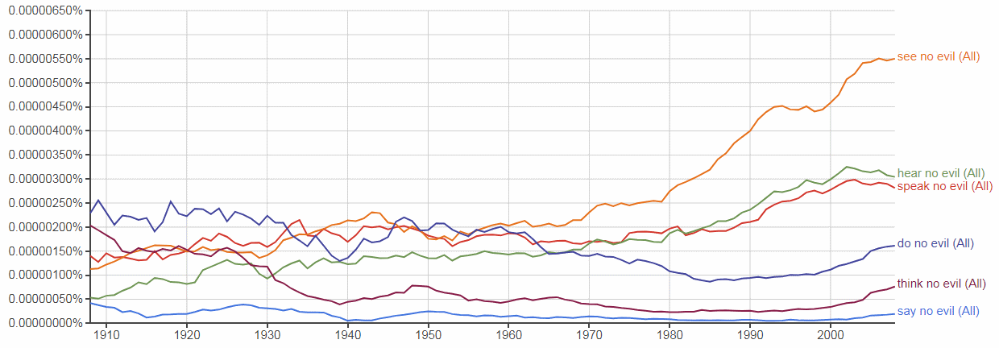

Proposal for new emoji: **Do-No-Evil Monkey**
=========================================

- **Author:** Christoph Päper
- **Mail:** christoph.paeper@crissov.de
- **Date:** 2017-05-29 submitted, 2017-07-08 last updated
- **Latest version:** https://crissov.github.io/unicode-proposals/fourth-monkey

Abstract
---

An emoji depicting a monkey emphatically doing nothing at all would complete the philosophical set of wise monkeys, although the triplet subset is much better known and more widespread (in part, because of existing emojis).

Introduction
------------

I hereby request the addition of a **Do-No-Evil Monkey** emoji to the Unicode Standard. Rationals, glyph examples, character properties as well as discussion of inclusion and exclusion factors are included on the following pages.
As per the [emoji submission guidelines](http://www.unicode.org/emoji/selection.html#submission) this document does not include the character proposal form.

| Char | Unicode Name   | Codepoint | Romanized Japanese            |
| ---- | -------------- | --------- | ----------------------------- |
| 🙈   | *See-No-Evil*  | U+1F648   | Mizaru / Minai                |
| 🙉   | *Hear-No-Evil* | U+1F649   | Kikazaru / Mikazaru / Kikanai |
| 🙊   | *Say-No-Evil*  | U+1F64A   | Iwazaru / Mazaru / Iwanai     |
|      | *Do-No-Evil*   | U+1F9??   | Shizaru / Shinai              |

The canonic Three Wise Monkeys are almost always depicted as covering their eyes 🙈, ears 🙉 and mouth 🙊, respectively, hence can easily be limited to show the head. 
There is some considerable deviation and variation for the less-canonic fourth monkey. I am specifically proposing the *Do-No-Evil Monkey*. Its hands are often shown crossed or tied and either held above its head or resting in its lap. The former depiction is better compatible with existing glyphs and can also symbolize the less frequent alternative *Think-No-Evil Monkey*, while the latter hints – sometimes in a quite obvious way – at the sexual innuendo of ‘doing something evil’ by covering the genitals. 
Other, more specific activities are also sometimes depicted, e.g. *Write-No-Evil* or *Smell-No-Evil*.

Names
--------------------

### CLDR Short Name
The preferred name of the character is “Do-No-Evil Monkey”, which closely matches the names of existing similar characters. 

### CLDR Keywords
The existing monkeys share most of their [English CLDR keywords](http://www.unicode.org/cldr/charts/latest/annotations/germanic.html). 
The table shows proposed additions in bold face.

| Name                  | Common Keywords                          | Individual Keywords               |
| --------------------- | ---------------------------------------- | --------------------------------- |
| see-no-evil monkey    | face, monkey; evil, forbidden, gesture, no, not, prohibited | see, **watch, blind**             |
| hear-no-evil monkey   | face, monkey; evil, forbidden, gesture, no, not, prohibited | hear, **listen, deaf**            |
| speak-no-evil monkey  | face, monkey; evil, forbidden, gesture, no, not, prohibited | speak, **tell, mute, taste, eat** |
| **do-no-evil monkey** | face, monkey; evil, forbidden, gesture, no, not, prohibited | **do, act, sex, think, dumb**     |
| monkey face           | face, monkey                             |                                   |

Images
------

Adapted Emojione 2 (or Emojitwo) graphics for a [variant 1 with arms crossed behind the head](img/emojione-monkey-arms-crossed.svg) and a [variant 2 with hands up](img/emojione-monkey-hands-up.svg):

 

Factors for Inclusion
---------------------

### A. Compatibility:

There are no known legacy character sets containing Do-No-Evil Monkey.

### B. Expected Usage Level: 

I expect the Do-No-Evil Monkey emoji to be used slightly less than its three existing siblings, but these are among the highly used emojis on [Emojistats][] and [Emojitracker][]. Not least because they are being used to express ‘I can’t …’, ‘I won’t …’, ‘I don’t wanna …’, ‘I didn’t …’ and ‘Please don’t …’ (hear, see, say/taste/smell something/anything). 

Despite all being rather popular, the members of the existing triplet enjoy different levels of usage frequency: the one covering its eye is the most frequently used of the bunch, the one covering its mouth comes in second and the one covering its ears is the least used one.

| Emoji                     | [Emojistats][] rank | [Emojitracker][] rank |
| ------------------------- | ------------------- | --------------------- |
| 🙈 *See-No-Evil* U+1F648  | 11                  | 29                    |
| 🙉 *Hear-No-Evil* U+1F649 | 141                 | 204                   |
| 🙊 *Say-No-Evil* U+1F64A  | 45                  | 54                    |

Above, I am including screenshot of a chart supplied by Google Trends showing the frequency of searches for the fourth monkey in comparison to the other three monkeys. It shows that the romanized Japanese “name” of the fourth monkey, _Shizaru_, is searched for almost as often as the others. _Mizaru_ is the most frequent term, perhaps because the other two canonic monkeys are also known in the West under different names:

- [Mizaru, Kikazaru, Iwazaru, Shizaru](https://trends.google.com/trends/explore?q=Mizaru,Kikazaru,Iwazaru,Shizaru)
- [Mizaru, Mikazaru, Mazaru, Shizaru](https://trends.google.com/trends/explore?q=Mizaru,Mikazaru,Mazaru,Shizaru)
- [Minai, Kikanai, Iwanai, Shinai](https://trends.google.com/trends/explore?q=Minai,Kikanai,Iwanai,Shinai)

The diagram with alternate _-nai_ transcriptions is not useful, because _shinai_ is also the weapon used in kendo and _minai_ may be a common misspelling of _Minaj_ (apparently the name of a popular singer).

[Google Ngram Viewer](https://books.google.com/ngrams/interactive_chart?content=say+no+evil%2Cspeak+no+evil%2Chear+no+evil%2Csee+no+evil%2Cdo+no+evil%2Cthink+no+evil&case_insensitive=on&year_start=1908&year_end=2008&corpus=15&smoothing=3) shows that _do no evil_ used to be the most popular of the relevant phrases in English print until the 1930s. It is used less than _say/speak/hear no evil_ currently, though. Searching with a placeholder for the [verb before _no evil_](https://books.google.com/ngrams/interactive_chart?content=*_VERB+no+evil&case_insensitive=on&year_start=1908&year_end=2008&corpus=15&smoothing=3) yields similar results.

### C. Image distinctiveness: 

In full-body images and figurines, the monkey’s hands are more often shown in the lap than above the head. Since all current and previous implementations of emojis opted for face-only glyphs for the other three monkeys, which are located in the Emoticons block after all, the reference image for the fourth one should also exclude the body. The graphic should be similar to the existing three wise monkeys which are consistently displayed as faces only. That means, a picture of a monkey crossing its arms before its chest or covering its genital area with its hands would not fit well with established emoji conventions. I therefore suggest that the Do-No-Evil Monkey is shown with its hands above, atop or behind its head, possibly tied with a rope or handcuffs. 

- Care must be taken to keep it distinguishable from the Hear-No-Evil Monkey: If drawn badly, a monkey raising both hands – as if being arrested – could look much like the one covering its ears 🙉. 
- If the position and posture of its hands and arms is not unusual enough, it could also be confused with  🐵 *Monkey Face* U+1F435, but certainly not with 🐒 *Monkey* U+1F412.

### D. Completeness:

This character is proposed to complete a frequently used set, although it is less popular than the subset that is already available.

### E. Frequently Requested:

I have no evidence of this character being frequently requested by name, but “it wasn’t me”, “I didn’t do nothing”, “my hands are tied” and their equivalents in other languages are frequently used phrases that would be subject to be augmented or substituted by the proposed emoji character.

Out of 165 items sold at the [Three Monkey Store on Etsy](https://www.etsy.com/shop/ThreeMonkeysStore), 18 (11%) show four monkeys (or other animals) and one even has five of them. That is though the vendor (falsely) claims on his homepage that the [fourth one was invented by the souvenir industry](http://www.three-monkeys.info/1/ORIGIN/FAQENG.htm#A09), because it was not part of the [Japanese Koshin belief](http://www.kcn-net.org/koshin/sanen/index.html). Of the 19 artists featured there, 3 (16%) show paintings with 4 different gestures: Candice Keegan, Maria Kononov, Boris Brayman. Of 132 poems quoted in several European languages, *at least* 6 (4.5%) deal with more than 3 actions:

- [No Evil by Thomas Paine](http://www.three-monkeys.info/1/WEBINFO/POETRY/POEMENG79.htm)
- [See no Evil, Hear no Evil, Speak no Evil and Do no Evil by Olga Polunin](http://www.three-monkeys.info/1/WEBINFO/POETRY/POEMENG49.htm)
- [The Fourth Monkey by Stephen Matthews](http://www.three-monkeys.info/1/WEBINFO/POETRY/POEMENG08.htm)
- [Three Monkey ... Plus One by Ry Lucero](http://www.three-monkeys.info/1/WEBINFO/POETRY/POEMENG40.htm)
- [The Fourth Monkey by unknown author](http://www.three-monkeys.info/1/WEBINFO/POETRY/POEMENG47.htm), [same in Dutch](http://www.three-monkeys.info/1/WEBINFO/POETRY/POEMNED20.htm)

It is a rough estimate, but there seems to be about 1 depiction of 4 monkeys for every 8 to 10 depictions of 3 monkeys. If one conducts an image search for “three wise monkeys” or some similar term on the web, there are *always* some matches that show four monkeys instead.

  

The alleged Confucian source of the monkeys has actually four parts: 非禮勿視，非禮勿聽，非禮勿言，非禮勿動, which is explored in [this Japanese page](http://jpnculture.net/sanen/) for instance. Therefore, this can be considered completing a set, where projected use and voiced requests are not as important as for original emoji proposals.

During the infamous [trial scene in the 1968 American movie Planet of the Apes](https://www.youtube.com/watch?v=6hX68X66jyw&t=2m), the three judges are shown with the iconic gestures, but it is not complete without the prosecutor (i.e. the only other orangutan in the room) who is just standing there with his arms hanging loosely.

Factors for Exclusion
---------------------

### F. Overly Specific:

One of the two existing generic monkey emojis – 🐵 and 🐒 – could be used in proximity to all of the three wise monkeys – 🙈 🙉 🙊 – to signify the fourth one without further explicit determination of its *verb*-No-Evil status: 🙈 🙉 🙊 🐵. This would be quite ambiguous, though, and does not work if one wants to refer  to the meaning of the fourth monkey specifically and exclusively.

### G. Open-ended:

There could be subsequent proposals for monkey emojis to symbolize missing senses or abilities, i.e. adding *feeling/touching*, *smelling* or *moving/walking* to existing *seeing/blind*, *hearing/deaf* and *speaking/mute* (which already doubles as *tasting* or *eating*). Glyphs for the Do-No-Evil Monkey should be able to cover anything usually done with one’s hands and either *thinking* or *copulating*.

Someone could want to propose other creature or face emojis – animal, human or other – to be used with the expressions exhibited by the monkeys, but that is pure speculation and would not depend on the existence of a fourth monkey. While the concept has been adopted to other species, the monkeys are always considered the canonic reference.

### H. Already Representable:

The intended meaning could be represented by an emoji sequence of either Monkey Face 🐵 or Monkey 🐒 and a negation symbol 🚫 next to a future activity, hand or other body part emoji, but this would not work well alongside the three existing wise monkeys which have dedicated code points assigned to them. 

### I. Logos, Brands etc.

There are some logos and brands that incorporate cartoon monkeys or apes, but none is known to me that would rely on one explicitly doing nothing. There are companies, brands and products named after the Japanese designations of the monkeys. 

[_Don’t be evil_](https://en.wikipedia.org/wiki/Don%27t_be_evil) is the motto of Google’s original corporate code of conduct.

### J. Transient:

The [English Wikipedia article][Wikipedia] states that the four-monkey version has been around at least as long as the three-monkey version. It is just that the triplet is more common in contemporary Japan where emojis originated. The philosophical concept has already been lasting long and will remain. 

The do-no-evil part of the concept can also be considered the amalgam or essence of the other three.

Sort location
-------------

The *Do-No-Evil Monkey* emoji should be sorted directly after the other Three Wise Monkey emojis in the `monkey-face` group of the `Smileys & People` section. 
It should be part of the same categories as these.
It should be added to the Supplemental Symbols and Pictographs block near other facial or animal emoji, e.g. in row U+1F99x.

The character does not decompose in any way, since U+1F648–A are also not considered compositions of either U+1F435 or U+1F412. 
It does not make use of emoji modifiers. It has emoji presentation by default. 

Other information
-----------------

### References

- [Wikipedia][] 

[Wikipedia]: https://en.wikipedia.org/wiki/Three_wise_monkeys#Variations
[Emojistats]: http://www.emojistats.org
[Emojitracker]: http://emojitracker.com

### License

The sample images included in this proposal were created by me and me alone based upon Emojione 2.2 art distributed under a Creative Commons Attribution license. I hereby declare that the Unicode Consortium and its members are granted the right to use, edit and redistribute these contents in any way they want without restriction.
Copies of the sample images are available at the following address:
http://github.com/Crissov/unicode-proposals/
